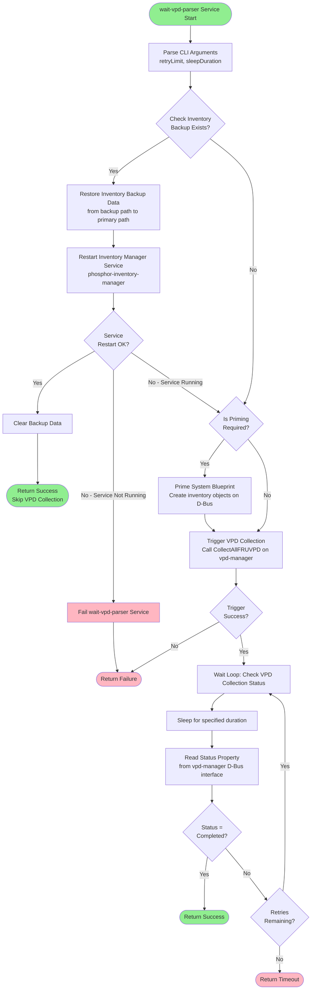
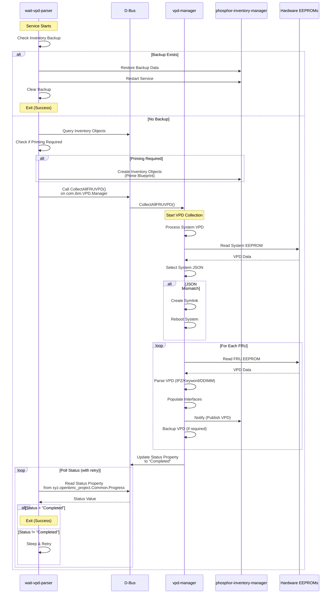

```mermaid
flowchart TD
    Start([vpd-manager Service Start]) --> InitIO[Initialize Boost ASIO<br/>I/O Context]
    InitIO --> CreateConnection[Create D-Bus Connection]
    CreateConnection --> CreateServer[Create Object Server]
    
    CreateServer --> AddInterfaces[Add D-Bus Interfaces<br/>com.ibm.VPD.Manager<br/>xyz.openbmc_project.Common.Progress]
    
    AddInterfaces --> CreateManager[Create Manager Instance]
    CreateManager --> CheckSingleFab{IBM Single FAB<br/>System?}
    
    CheckSingleFab -->|Yes & Power Off| SingleFabCheck[Perform Single FAB<br/>IM Override Check]
    CheckSingleFab -->|No or Power On| RegisterMethods
    
    SingleFabCheck --> SingleFabValid{Valid<br/>Config?}
    SingleFabValid -->|No| QuiesceBMC[Quiesce BMC<br/>Invalid Configuration]
    SingleFabValid -->|Yes| RegisterMethods
    
    RegisterMethods[Register D-Bus Methods<br/>UpdateKeyword, ReadKeyword,<br/>CollectFRUVPD, CollectAllFRUVPD, etc.] --> RegisterProps[Register D-Bus Properties<br/>Status property]
    
    RegisterProps --> ReadVpdMode[Read VPD Collection Mode<br/>Check field mode status]
    ReadVpdMode --> InitIbmHandler[Initialize IBM Handler<br/>OEM-specific logic]
    
    InitIbmHandler --> CheckSymlink{Config JSON<br/>Symlink Exists?}
    
    CheckSymlink -->|No & Power On| LogWarning[Log Warning PEL<br/>Missing symlink in power on]
    CheckSymlink -->|No & Power Off| SkipCollection
    CheckSymlink -->|Yes| InitWorker[Initialize Worker Instance<br/>Parse system config JSON]
    
    LogWarning --> SkipCollection[Skip Initial Collection<br/>Wait for external trigger]
    
    InitWorker --> InitBackupRestore[Initialize Backup & Restore<br/>For system VPD sync]
    InitBackupRestore --> InitListeners[Initialize Event Listeners<br/>Asset tag, Host state, Presence]
    InitListeners --> InitGpioMonitor[Initialize GPIO Monitor<br/>For hot-plug detection]
    
    InitGpioMonitor --> InitBiosHandler[Initialize BIOS Handler<br/>For BIOS attribute updates]
    InitBiosHandler --> InitializeInterfaces[Initialize D-Bus Interfaces]
    
    InitializeInterfaces --> ClaimBusName[Claim D-Bus Bus Name<br/>com.ibm.VPD.Manager]
    ClaimBusName --> StartEventLoop[Start Event Loop<br/>io_context.run]
    
    SkipCollection --> ClaimBusName
    
    StartEventLoop --> WaitForAPI{Wait for<br/>D-Bus API Calls}
    
    WaitForAPI -->|CollectAllFRUVPD| CollectAll[Trigger All FRU Collection<br/>via IBM Handler]
    WaitForAPI -->|CollectFRUVPD| CollectSingle[Collect Single FRU VPD]
    WaitForAPI -->|UpdateKeyword| UpdateKwd[Update VPD Keyword<br/>Write to hardware & D-Bus]
    WaitForAPI -->|ReadKeyword| ReadKwd[Read VPD Keyword<br/>from hardware]
    WaitForAPI -->|DeleteFRUVPD| DeleteFru[Delete FRU VPD<br/>from D-Bus]
    WaitForAPI -->|GetExpandedLocationCode| GetLocCode[Get Expanded Location Code]
    WaitForAPI -->|PerformVPDRecollection| Recollect[Perform VPD Recollection<br/>for standby-replaceable FRUs]
    
    CollectAll --> ProcessSystemVpd[Process System VPD<br/>Motherboard EEPROM]
    ProcessSystemVpd --> SelectJSON{Select Correct<br/>System JSON?}
    
    SelectJSON -->|No Match| CreateSymlink[Create Symlink to<br/>Matching JSON]
    SelectJSON -->|Match Found| ProcessFRUs
    
    CreateSymlink --> RebootSystem[Reboot System<br/>Apply new configuration]
    
    ProcessFRUs[Process All FRUs from JSON<br/>Multi-threaded collection] --> ParseVPD[For Each FRU:<br/>Parse VPD Data]
    
    ParseVPD --> DetermineParser{Determine<br/>Parser Type}
    
    DetermineParser -->|IPZ Format| IPZParser[Use IPZ Parser<br/>Parse records & keywords]
    DetermineParser -->|Keyword Format| KwdParser[Use Keyword Parser<br/>Parse keywords]
    DetermineParser -->|DDIMM Format| DDIMMParser[Use DDIMM Parser<br/>Parse DIMM data]
    DetermineParser -->|ISDIMM Format| ISDIMMParser[Use ISDIMM Parser<br/>Parse ISDIMM data]
    
    IPZParser --> PopulateInterfaces[Populate D-Bus Interfaces<br/>Map VPD to properties]
    KwdParser --> PopulateInterfaces
    DDIMMParser --> PopulateInterfaces
    ISDIMMParser --> PopulateInterfaces
    
    PopulateInterfaces --> ProcessExtraInterfaces[Process Extra Interfaces<br/>Location codes, etc.]
    ProcessExtraInterfaces --> ProcessInherit[Process Inherit Flag<br/>Common interfaces]
    ProcessInherit --> ProcessCopyRecord[Process Copy Record<br/>Duplicate data if needed]
    
    ProcessCopyRecord --> SetPresent[Set Present Property<br/>Mark FRU as present]
    SetPresent --> PublishDbus[Publish to D-Bus<br/>Call PIM Notify method]
    
    PublishDbus --> BackupVPD{Backup<br/>Required?}
    
    BackupVPD -->|Yes| BackupToFile[Backup VPD to File<br/>For system VPD sync]
    BackupVPD -->|No| CheckComplete
    
    BackupToFile --> CheckComplete{All FRUs<br/>Processed?}
    
    CheckComplete -->|No| ParseVPD
    CheckComplete -->|Yes| UpdateStatus[Update Status Property<br/>to Completed/Failed]
    
    UpdateStatus --> WaitForAPI
    
    CollectSingle --> ParseVPD
    UpdateKwd --> UpdateParser[Use Parser to Update<br/>Keyword on hardware]
    UpdateParser --> UpdateDbus[Update D-Bus Property]
    UpdateDbus --> UpdateBackup[Update Backup File]
    UpdateBackup --> WaitForAPI
    
    ReadKwd --> ReadParser[Use Parser to Read<br/>Keyword from hardware]
    ReadParser --> ReturnValue[Return Keyword Value]
    ReturnValue --> WaitForAPI
    
    DeleteFru --> DeleteFromDbus[Delete FRU from D-Bus<br/>via Worker]
    DeleteFromDbus --> WaitForAPI
    
    GetLocCode --> QueryJSON[Query System JSON<br/>for location mapping]
    QueryJSON --> ReadDbusLoc[Read Location from D-Bus]
    ReadDbusLoc --> WaitForAPI
    
    Recollect --> TriggerWorker[Trigger Worker to<br/>Recollect Standby FRUs]
    TriggerWorker --> WaitForAPI
    
    QuiesceBMC --> End([Service Failed])

    style Start fill:#90EE90
    style End fill:#FFB6C1
    style QuiesceBMC fill:#FFB6C1
    style RebootSystem fill:#FFD700
    style StartEventLoop fill:#87CEEB
```

# OpenPower VPD Parser - API Flow Documentation

This document provides comprehensive high-level flowcharts showing the API flow for both `wait-vpd-parser` and `vpd-manager` services in the openpower-vpd-parser repository.

---

## 1. wait-vpd-parser Service Flow

The `wait-vpd-parser` service is responsible for preparing the system inventory before VPD collection begins. It handles inventory backup restoration and primes the inventory blueprint.

### High-Level Flow Diagram

### Key Components

#### 1. Inventory Backup Handler
- **File**: [`inventory_backup_handler.cpp`](wait-vpd-parser/src/inventory_backup_handler.cpp:1)
- **Functions**:
  - [`checkInventoryBackupPath()`](wait-vpd-parser/src/inventory_backup_handler.cpp:7): Checks if backup data exists
  - [`restoreInventoryBackupData()`](wait-vpd-parser/src/inventory_backup_handler.cpp:46): Restores backup to primary path
  - [`restartInventoryManagerService()`](wait-vpd-parser/src/inventory_backup_handler.cpp:191): Restarts PIM service
  - [`clearInventoryBackupData()`](wait-vpd-parser/src/inventory_backup_handler.cpp:158): Cleans up backup data

#### 2. Prime Inventory
- **File**: [`prime_inventory.cpp`](wait-vpd-parser/src/prime_inventory.cpp:1)
- **Functions**:
  - [`isPrimingRequired()`](wait-vpd-parser/src/prime_inventory.cpp:51): Checks if inventory needs priming
  - [`primeSystemBlueprint()`](wait-vpd-parser/src/prime_inventory.cpp:92): Creates inventory objects on D-Bus
  - [`primeInventory()`](wait-vpd-parser/src/prime_inventory.cpp:147): Primes individual FRU inventory

#### 3. Main Flow
- **File**: [`wait_vpd_parser.cpp`](wait-vpd-parser/src/wait_vpd_parser.cpp:1)
- **Functions**:
  - [`checkAndHandleInventoryBackup()`](wait-vpd-parser/src/wait_vpd_parser.cpp:123): Orchestrates backup restoration
  - [`collectAllFruVpd()`](wait-vpd-parser/src/wait_vpd_parser.cpp:86): Triggers VPD collection via D-Bus
  - [`checkVpdCollectionStatus()`](wait-vpd-parser/src/wait_vpd_parser.cpp:30): Monitors collection progress

---

## 2. vpd-manager Service Flow

The `vpd-manager` service is the core VPD collection engine that parses VPD data from hardware, publishes it to D-Bus, and provides various VPD management APIs.

### High-Level Flow Diagram

### Key Components

#### 1. Manager Class
- **File**: [`manager.cpp`](vpd-manager/src/manager.cpp:1)
- **Key Methods**:
  - [`updateKeyword()`](vpd-manager/src/manager.cpp:196): Updates VPD keyword on hardware and D-Bus
  - [`readKeyword()`](vpd-manager/src/manager.cpp:386): Reads VPD keyword from hardware
  - [`collectSingleFruVpd()`](vpd-manager/src/manager.cpp:437): Collects single FRU VPD
  - [`collectAllFruVpd()`](vpd-manager/src/manager.cpp:763): Triggers collection for all FRUs
  - [`deleteSingleFruVpd()`](vpd-manager/src/manager.cpp:454): Deletes FRU VPD from D-Bus
  - [`getExpandedLocationCode()`](vpd-manager/src/manager.cpp:509): Gets expanded location code
  - [`performVpdRecollection()`](vpd-manager/src/manager.cpp:755): Performs VPD recollection

#### 2. Worker Class
- **File**: [`worker.cpp`](vpd-manager/src/worker.cpp:1)
- **Key Methods**:
  - [`collectFrusFromJson()`](vpd-manager/include/worker.hpp:74): Processes all FRUs from JSON
  - [`parseVpdFile()`](vpd-manager/include/worker.hpp:81): Parses VPD file
  - [`populateDbus()`](vpd-manager/include/worker.hpp:93): Populates D-Bus with VPD data
  - [`collectSingleFruVpd()`](vpd-manager/include/worker.hpp:172): Collects single FRU
  - [`deleteFruVpd()`](vpd-manager/include/worker.hpp:104): Deletes FRU VPD

#### 3. IBM Handler (OEM-specific)
- **File**: [`ibm_handler.cpp`](vpd-manager/oem-handler/ibm_handler.cpp:1)
- **Responsibilities**:
  - System configuration JSON selection
  - Worker initialization
  - Backup and restore management
  - Event listener setup
  - GPIO monitoring for hot-plug

#### 4. Parser Factory & Parsers
- **Factory**: [`parser_factory.cpp`](vpd-manager/src/parser_factory.cpp:1)
- **Parser Types**:
  - **IPZ Parser**: [`ipz_parser.cpp`](vpd-manager/src/ipz_parser.cpp:1) - For IPZ format VPD
  - **Keyword Parser**: [`keyword_vpd_parser.cpp`](vpd-manager/src/keyword_vpd_parser.cpp:1) - For keyword-based VPD
  - **DDIMM Parser**: [`ddimm_parser.cpp`](vpd-manager/src/ddimm_parser.cpp:1) - For DDR4/DDR5 DIMMs
  - **ISDIMM Parser**: [`isdimm_parser.cpp`](vpd-manager/src/isdimm_parser.cpp:1) - For ISDIMM format

---

## 3. Service Interaction Flow

### API Interactions Between Services

### D-Bus Interfaces Exposed

#### vpd-manager Interfaces

1. **com.ibm.VPD.Manager** (Main Interface)
   - Methods:
     - `UpdateKeyword(path, params)` → int
     - `WriteKeywordOnHardware(path, params)` → int
     - `ReadKeyword(path, params)` → variant
     - `CollectFRUVPD(objectPath)` → void
     - `deleteFRUVPD(objectPath)` → void
     - `CollectAllFRUVPD()` → bool
     - `GetExpandedLocationCode(unexpandedCode, nodeNumber)` → string
     - `GetFRUsByExpandedLocationCode(expandedCode)` → array of paths
     - `GetFRUsByUnexpandedLocationCode(unexpandedCode, nodeNumber)` → array of paths
     - `GetHardwarePath(dbusPath)` → string
     - `PerformVPDRecollection()` → void

2. **xyz.openbmc_project.Common.Progress** (Status Interface)
   - Properties:
     - `Status` (string): "NotStarted" | "InProgress" | "Completed" | "Failed"

---

## 4. Key Data Flows

### VPD Collection Flow

1. **Initialization Phase**
   - wait-vpd-parser checks for backup data
   - If backup exists, restore and skip collection
   - If no backup, prime inventory blueprint

2. **Trigger Phase**
   - wait-vpd-parser calls `CollectAllFRUVPD()` on vpd-manager
   - vpd-manager updates Status to "InProgress"

3. **Collection Phase**
   - vpd-manager processes system VPD first
   - Selects appropriate system configuration JSON
   - Creates worker threads for parallel FRU collection
   - Each thread:
     - Reads EEPROM data
     - Determines parser type
     - Parses VPD data
     - Populates D-Bus interfaces
     - Publishes to phosphor-inventory-manager
     - Backs up data if required

4. **Completion Phase**
   - vpd-manager updates Status to "Completed" or "Failed"
   - wait-vpd-parser polls Status property
   - wait-vpd-parser exits when Status is "Completed"

### VPD Update Flow

1. **Update Request**
   - External client calls `UpdateKeyword()` on vpd-manager
   - Provides: VPD path, record name, keyword name, new value

2. **Update Processing**
   - vpd-manager creates parser instance
   - Parser writes to hardware EEPROM
   - Parser updates D-Bus property
   - Backup file is updated (if applicable)
   - Inherited FRUs are updated

3. **Update Response**
   - Returns success/failure status
   - Logs VPD write operation

---

## 5. Configuration Files

### System Configuration JSON
- **Location**: `/usr/share/vpd/` (various system-specific JSONs)
- **Symlink**: `/var/lib/vpd/vpd_inventory.json` → selected system JSON
- **Purpose**: Defines FRU inventory structure, EEPROM paths, D-Bus interfaces

### Backup & Restore Configuration
- **Files**: `backup_restore_*.json`
- **Purpose**: Defines which VPD data should be backed up for system VPD synchronization

---

## 6. Error Handling

### wait-vpd-parser
- Logs errors via Logger class
- Creates PELs (Platform Event Logs) for critical failures
- Returns appropriate exit codes
- Handles service restart failures gracefully

### vpd-manager
- Comprehensive exception handling in all APIs
- PEL creation for various error scenarios
- Graceful degradation (continues operation even if some FRUs fail)
- Retry mechanisms for transient failures

---

## 7. Threading Model

### wait-vpd-parser
- Single-threaded service
- Synchronous operations
- Polls vpd-manager status in a loop

### vpd-manager
- Multi-threaded VPD collection
- Configurable thread pool (default: 4 threads at standby, 1 at runtime)
- Semaphore-based thread limiting
- Asynchronous D-Bus operations using Boost ASIO

---

## Summary

The openpower-vpd-parser system consists of two cooperating services:

1. **wait-vpd-parser**: Orchestrator service that prepares the system and triggers VPD collection
2. **vpd-manager**: Core VPD collection engine that parses hardware data and publishes to D-Bus

These services work together to ensure reliable VPD data collection, backup/restore capabilities, and provide comprehensive VPD management APIs for the OpenPower platform.