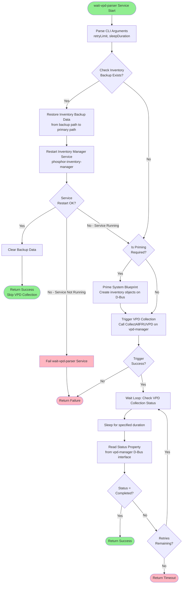
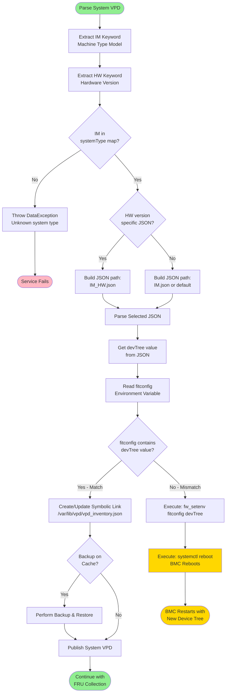
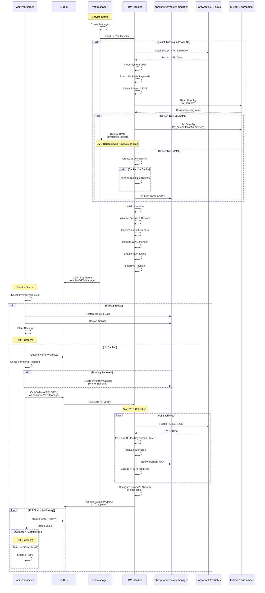

```mermaid
flowchart TD
    Start([vpd-manager Service Start]) --> InitIO[Initialize Boost ASIO<br/>I/O Context]
    InitIO --> CreateConnection[Create D-Bus Connection]
    CreateConnection --> CreateServer[Create Object Server]
    
    CreateServer --> AddInterfaces[Add D-Bus Interfaces<br/>com.ibm.VPD.Manager<br/>xyz.openbmc_project.Common.Progress]
    
    AddInterfaces --> CreateManager[Create Manager Instance]
    CreateManager --> CheckSingleFab{IBM Single FAB<br/>System & Power Off?}
    
    CheckSingleFab -->|Yes| SingleFabCheck[Perform Single FAB<br/>IM Override Check]
    CheckSingleFab -->|No| RegisterMethods
    
    SingleFabCheck --> SingleFabValid{Valid<br/>Config?}
    SingleFabValid -->|No| QuiesceBMC[Quiesce BMC<br/>Invalid Configuration]
    SingleFabValid -->|Yes| RegisterMethods
    
    RegisterMethods[Register D-Bus Methods<br/>UpdateKeyword, ReadKeyword,<br/>CollectFRUVPD, CollectAllFRUVPD, etc.] --> RegisterProps[Register D-Bus Properties<br/>Status property]
    
    RegisterProps --> ReadVpdMode[Read VPD Collection Mode<br/>Check field mode status]
    ReadVpdMode --> InitIbmHandler[Initialize IBM Handler<br/>OEM-specific logic]
    
    InitIbmHandler --> CheckSymlink{Config JSON<br/>Symlink Exists?}
    
    CheckSymlink -->|No & Power On| LogWarning[Log Warning PEL<br/>Missing symlink in power on]
    CheckSymlink -->|No & Power Off| PerformInitialSetup
    CheckSymlink -->|Yes| PerformInitialSetup
    
    LogWarning --> SkipInitialCollection[Skip Initial Collection<br/>Wait for external trigger]
    
    PerformInitialSetup[Perform Initial Setup<br/>Parse default/existing JSON] --> ParseSystemVpd[Parse System VPD<br/>from motherboard EEPROM]
    
    ParseSystemVpd --> GetSystemJson[Get System JSON<br/>based on IM & HW keywords]
    GetSystemJson --> CheckDevTree{Device Tree<br/>Match?}
    
    CheckDevTree -->|No Match| SetFitConfig[Set fitconfig Environment Variable<br/>fw_setenv fitconfig devtree_name]
    SetFitConfig --> RebootBMC[Reboot BMC<br/>systemctl reboot]
    
    CheckDevTree -->|Match| SetSymlink[Set JSON Symbolic Link<br/>/var/lib/vpd/vpd_inventory.json]
    SetSymlink --> CheckBackupCache{Backup on<br/>Cache?}
    
    CheckBackupCache -->|Yes| PerformBackupRestore[Perform Backup & Restore<br/>Sync system VPD between hardware & cache]
    CheckBackupCache -->|No| PublishSystemVpd
    
    PerformBackupRestore --> PublishSystemVpd[Publish System VPD on D-Bus]
    PublishSystemVpd --> InitWorker[Initialize Worker Instance<br/>Parse system config JSON]
    
    InitWorker --> InitBackupRestore[Initialize Backup & Restore<br/>For system VPD sync]
    InitBackupRestore --> InitListeners[Initialize Event Listeners<br/>Asset tag, Host state, Presence]
    InitListeners --> InitGpioMonitor[Initialize GPIO Monitor<br/>For hot-plug detection]
    
    InitGpioMonitor --> InitBiosHandler[Initialize BIOS Handler<br/>For BIOS attribute updates]
    InitBiosHandler --> EnableMux[Enable MUX Chips<br/>Set holdidle=0]
    EnableMux --> SetBmcPosition[Set BMC Position<br/>For multi-BMC systems]
    
    SetBmcPosition --> InitializeInterfaces[Initialize D-Bus Interfaces]
    InitializeInterfaces --> ClaimBusName[Claim D-Bus Bus Name<br/>com.ibm.VPD.Manager]
    
    SkipInitialCollection --> ClaimBusName
    
    ClaimBusName --> StartEventLoop[Start Event Loop<br/>io_context.run]
    StartEventLoop --> WaitForAPI{Wait for<br/>D-Bus API Calls}
    
    WaitForAPI -->|CollectAllFRUVPD| CollectAll[Trigger All FRU Collection<br/>via IBM Handler]
    WaitForAPI -->|CollectFRUVPD| CollectSingle[Collect Single FRU VPD]
    WaitForAPI -->|UpdateKeyword| UpdateKwd[Update VPD Keyword<br/>Write to hardware & D-Bus]
    WaitForAPI -->|ReadKeyword| ReadKwd[Read VPD Keyword<br/>from hardware]
    WaitForAPI -->|DeleteFRUVPD| DeleteFru[Delete FRU VPD<br/>from D-Bus]
    WaitForAPI -->|GetExpandedLocationCode| GetLocCode[Get Expanded Location Code]
    WaitForAPI -->|PerformVPDRecollection| Recollect[Perform VPD Recollection<br/>for standby-replaceable FRUs]
    
    CollectAll --> ProcessFRUs[Process All FRUs from JSON<br/>Multi-threaded collection]
    ProcessFRUs --> ParseVPD[For Each FRU:<br/>Parse VPD Data]
    
    ParseVPD --> DetermineParser{Determine<br/>Parser Type}
    
    DetermineParser -->|IPZ Format| IPZParser[Use IPZ Parser<br/>Parse records & keywords]
    DetermineParser -->|Keyword Format| KwdParser[Use Keyword Parser<br/>Parse keywords]
    DetermineParser -->|DDIMM Format| DDIMMParser[Use DDIMM Parser<br/>Parse DIMM data]
    DetermineParser -->|ISDIMM Format| ISDIMMParser[Use ISDIMM Parser<br/>Parse ISDIMM data]
    
    IPZParser --> PopulateInterfaces[Populate D-Bus Interfaces<br/>Map VPD to properties]
    KwdParser --> PopulateInterfaces
    DDIMMParser --> PopulateInterfaces
    ISDIMMParser --> PopulateInterfaces
    
    PopulateInterfaces --> ProcessExtraInterfaces[Process Extra Interfaces<br/>Location codes, etc.]
    ProcessExtraInterfaces --> ProcessInherit[Process Inherit Flag<br/>Common interfaces]
    ProcessInherit --> ProcessCopyRecord[Process Copy Record<br/>Duplicate data if needed]
    
    ProcessCopyRecord --> SetPresent[Set Present Property<br/>Mark FRU as present]
    SetPresent --> PublishDbus[Publish to D-Bus<br/>Call PIM Notify method]
    
    PublishDbus --> BackupVPD{Backup<br/>Required?}
    
    BackupVPD -->|Yes| BackupToFile[Backup VPD to File<br/>For system VPD sync]
    BackupVPD -->|No| CheckComplete
    
    BackupToFile --> CheckComplete{All FRUs<br/>Processed?}
    
    CheckComplete -->|No| ParseVPD
    CheckComplete -->|Yes| ConfigurePowerVs[Configure PowerVS System<br/>Update part numbers if needed]
    
    ConfigurePowerVs --> UpdateStatus[Update Status Property<br/>to Completed/Failed]
    UpdateStatus --> WaitForAPI
    
    CollectSingle --> ParseVPD
    UpdateKwd --> UpdateParser[Use Parser to Update<br/>Keyword on hardware]
    UpdateParser --> UpdateDbus[Update D-Bus Property]
    UpdateDbus --> UpdateBackup[Update Backup File]
    UpdateBackup --> UpdateInherited[Update Inherited FRUs]
    UpdateInherited --> WaitForAPI
    
    ReadKwd --> ReadParser[Use Parser to Read<br/>Keyword from hardware]
    ReadParser --> ReturnValue[Return Keyword Value]
    ReturnValue --> WaitForAPI
    
    DeleteFru --> DeleteFromDbus[Delete FRU from D-Bus<br/>via Worker]
    DeleteFromDbus --> WaitForAPI
    
    GetLocCode --> QueryJSON[Query System JSON<br/>for location mapping]
    QueryJSON --> ReadDbusLoc[Read Location from D-Bus]
    ReadDbusLoc --> WaitForAPI
    
    Recollect --> TriggerWorker[Trigger Worker to<br/>Recollect Standby FRUs]
    TriggerWorker --> WaitForAPI
    
    QuiesceBMC --> End([Service Failed])
    RebootBMC --> End2([BMC Reboots<br/>Service restarts with new device tree])

    style Start fill:#90EE90
    style End fill:#FFB6C1
    style End2 fill:#FFD700
    style QuiesceBMC fill:#FFB6C1
    style RebootBMC fill:#FFD700
    style StartEventLoop fill:#87CEEB
```

# OpenPower VPD Parser - IBM OEM API Flow

This document provides comprehensive high-level flowcharts showing the API flow for both `wait-vpd-parser` and `vpd-manager` services specifically for **IBM OEM systems** in the openpower-vpd-parser repository.

---

## 1. wait-vpd-parser Service Flow (IBM Systems)

The `wait-vpd-parser` service is identical for both IBM and non-IBM systems. It prepares the system inventory before VPD collection begins.

### High-Level Flow Diagram



---

## 2. vpd-manager Service Flow (IBM Systems)

The `vpd-manager` service for IBM systems includes OEM-specific logic for device tree selection, JSON configuration, backup/restore, and system-specific features.

### High-Level Flow Diagram



---

## 3. IBM-Specific Components

### IBM Handler Class
- **File**: [`ibm_handler.cpp`](vpd-manager/oem-handler/ibm_handler.cpp:1)
- **Key Responsibilities**:
  1. **Device Tree & JSON Selection**: [`setDeviceTreeAndJson()`](vpd-manager/oem-handler/ibm_handler.cpp:936)
     - Parses system VPD to extract IM (Machine Type) and HW (Hardware Version) keywords
     - Selects appropriate system configuration JSON based on these values
     - Checks if current device tree matches the required one
     - If mismatch: Sets `fitconfig` environment variable and reboots BMC
     - If match: Creates symbolic link to correct JSON
  
  2. **System JSON Selection**: [`getSystemJson()`](vpd-manager/oem-handler/ibm_handler.cpp:551)
     - Maps IM keyword to system type
     - Uses HW keyword for version-specific JSON selection
     - Returns path to appropriate JSON file
  
  3. **Backup & Restore**: [`performBackupAndRestore()`](vpd-manager/oem-handler/ibm_handler.cpp:735)
     - Syncs system VPD between hardware EEPROM and BMC cache
     - Handles systems where system VPD is on cache vs hardware
  
  4. **Environment Variable Management**:
     - [`setEnvAndReboot()`](vpd-manager/oem-handler/ibm_handler.cpp:621): Sets U-Boot environment variable and reboots
     - [`readFitConfigValue()`](vpd-manager/oem-handler/ibm_handler.cpp:650): Reads current fitconfig value
  
  5. **PowerVS Configuration**: [`ConfigurePowerVsSystem()`](vpd-manager/oem-handler/ibm_handler.cpp:447)
     - Updates part numbers for PowerVS-specific FRUs
     - Checks CCIN values before updating
  
  6. **Event Listeners**: [`initEventListeners()`](vpd-manager/oem-handler/ibm_handler.cpp:187)
     - Asset tag change callback
     - Host state change callback
     - Presence change callback
  
  7. **GPIO Monitoring**: Hot-plug detection for FRUs
  
  8. **MUX Management**: [`enableMuxChips()`](vpd-manager/oem-handler/ibm_handler.cpp:508)
     - Enables I2C multiplexers by setting holdidle=0
  
  9. **BMC Position**: [`setBmcPosition()`](vpd-manager/oem-handler/ibm_handler.hpp:267)
     - Sets BMC position for multi-BMC systems (e.g., RBMC)

### Single FAB Check
- **Purpose**: Validates system configuration for single-fabric systems
- **Action**: Quiesces BMC if invalid configuration detected
- **Condition**: Only performed when chassis is powered off

---

## 4. Device Tree & JSON Selection Flow

### Detailed Flow



### Example Scenario

**System**: IBM Power10 Server
- **IM Keyword**: `50001000` (from system VPD)
- **HW Keyword**: `02` (from system VPD)
- **Selected JSON**: `50001000_v2.json`
- **Device Tree**: `aspeed-bmc-ibm-rainier-4u`

**Flow**:
1. Parse system VPD from motherboard EEPROM
2. Extract IM=`50001000`, HW=`02`
3. Lookup in configuration map → JSON: `50001000_v2.json`
4. Parse `50001000_v2.json` → devTree: `aspeed-bmc-ibm-rainier-4u`
5. Read current fitconfig: `fw_printenv fitconfig`
6. **If mismatch**: 
   - Execute: `fw_setenv fitconfig aspeed-bmc-ibm-rainier-4u`
   - Execute: `systemctl reboot`
   - BMC reboots with new device tree
7. **If match**:
   - Create symlink: `/var/lib/vpd/vpd_inventory.json` → `/usr/share/vpd/50001000_v2.json`
   - Continue with VPD collection

---

## 5. Service Interaction Flow (IBM Systems)



---

## 6. IBM-Specific Features

### 1. System Configuration Mapping
- **Configuration File**: [`configuration.hpp`](configuration/configuration.hpp:1)
- **Maps**: IM keyword → (System Type, HW Version List)
- **Example**:
  ```cpp
  {"50001000", {"Rainier", {{"01", ""}, {"02", "v2"}}}}
  ```

### 2. Backup & Restore
- **Purpose**: Sync system VPD between hardware EEPROM and BMC cache
- **Configuration**: `backup_restore_*.json` files
- **Scenarios**:
  - System VPD on hardware, backup on cache
  - System VPD on cache, backup on hardware

### 3. PowerVS Systems
- **Configuration**: `*_power_vs.json` files
- **Purpose**: Update part numbers for PowerVS-specific FRUs
- **Trigger**: After all FRU collection completes

### 4. Location Code Expansion
- **Unexpanded**: `Ufcs-P0-C1`
- **Expanded**: `UABCD.123.ND0.SE01-P0-C1`
- **Uses**: FC (Frame Code) and SE (Serial Number) from system VPD

### 5. Correlated Properties
- **Configuration**: `correlated_properties*.json`
- **Purpose**: Update properties based on relationships between FRUs
- **Example**: Update CPU frequency based on DIMM configuration

---

## Summary

The IBM OEM implementation adds significant complexity to the base VPD manager:

1. **Dynamic Device Tree Selection**: Automatically selects and applies correct device tree based on system VPD
2. **BMC Reboot on Mismatch**: Reboots BMC when device tree needs to change
3. **System-Specific JSON**: Selects appropriate configuration JSON based on machine type and hardware version
4. **Backup & Restore**: Syncs system VPD between hardware and cache
5. **PowerVS Support**: Special handling for PowerVS cloud systems
6. **Event-Driven Updates**: Monitors for asset tag, host state, and presence changes
7. **Hot-Plug Support**: GPIO monitoring for FRU insertion/removal
8. **Multi-BMC Support**: Handles systems with redundant BMCs

These features ensure the VPD manager can handle the diverse IBM Power Systems portfolio with minimal manual configuration.