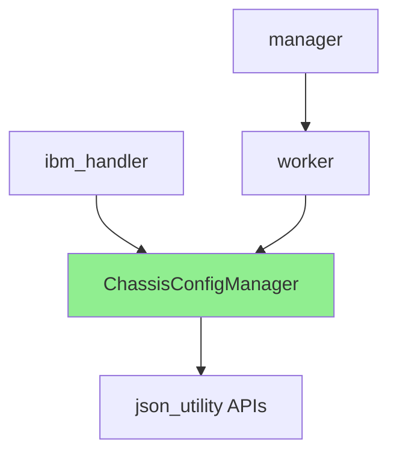

# Chassis Config Manager : Design Proposal for handling multi-chassis system

## Summary

This document proposes an optimized design for supporting multi-chassis systems
in the openpower-vpd-parser project. The current JSON structure is designed for
single-chassis systems, and this proposal suggests a mechanism to support
multiple chassis while maintaining O(1) lookup performance for EEPROM-to-chassis
mapping.

---

## Current System Analysis

### Current JSON Structure (Single Chassis)

The existing system configuration JSON (for eg. `70001000.json`) has the
following structure:

```json
{
  "devTree": "conf-aspeed-bmc-ibm-fuji.dtb",
  "backupRestoreConfigPath": "/usr/share/vpd/backup_restore_50003000.json",
  "commonInterfaces": { ... },
  "muxes": [ ... ],
  "frus": {
    "/sys/bus/i2c/drivers/at24/8-0050/eeprom": [ ... ],
    "/sys/bus/i2c/drivers/at24/8-0051/eeprom": [ ... ],
    ...
  }
}
```

### Key Limitations

1. **Single Chassis Assumption**: All FRUs are implicitly assumed to belong to
   one chassis
2. **No Chassis Identification**: No mechanism to identify which chassis an
   EEPROM belongs to
3. **Scalability Issues**: Multi-chassis systems would require multiple JSON
   files or complex workarounds

### Current API Usage Pattern

Key APIs that need chassis context:

- All APIs in
  [`json_utility.hpp`](vpd-manager/include/utility/json_utility.hpp:1) that
  accept `i_sysCfgJsonObj` parameter

---

## Proposed Multi-Chassis Design

### Functional requirements

1. **Write keyword**

- Parameter : Object path/EEPROM path

2. **Write keyword on hardware**

- Parameter : EEPROM path

3. **Read keyword**

- Parameter : Object path/EEPROM path

4. **CollectFRUVPD**

- Parameter : Object path

5. **deleteFRUVPD**

- Parameter : Object path

6. **GetExpandedLocationCode**

- Parameter :
  - Unexpanded location code
  - Node number

7. **GetFRUsByExpandedLocationCode**

- Parameter :
  - Unexpanded location code
  - Node number

8. **GetFRUsByUnexpandedLocationCode**

- Parameter :
  - Unexpanded location code
  - Node number

9. **GetHardwarePath**

- Parameter : Object path

10. **PerformVPDRecollection**
11. **CollectAllFRUVPD**
12. **CollectFRUVPDForChassis**

- Parameter : Chassis ID
  - Concurrent maintenance on a Chassis

### Design Goals

1. **O(1) Lookup**:

- Achieve constant-time lookup for chassis details given an Object path
- Achieve constant-time lookup for EEPROMs given chassis details

2. **Backward Compatibility**: Existing single-chassis JSONs should work without
   modification
3. **Minimal API Changes**: Existing
   [`json_utility`](vpd-manager/include/utility/json_utility.hpp:1) APIs should
   remain unchanged
4. **Scalability**: Support systems with multiple chassis efficiently
5. **Maintainability**: Clear separation of concerns with an abstraction layer

---

## Architecture Design

### Component Overview



### ChassisConfigManager - New Abstraction Layer

Create a new singleton class
[`ChassisConfigManager`](vpd-manager/include/chassis_manager.hpp:1) that sits as a
layer between vpd-manager (`ibm_handler`, `worker` and `manager`) and
json_utility APIs. json_utility APIs should not be affected.

#### Key Responsibilities

1. **Build O(1) Lookup Cache**: Create in-memory hash map for chassis-to-EEPROM
   mapping
2. **Provide Chassis Context**: Return appropriate chassis-specific JSON for API
   calls
3. **Backward Compatibility**: Handle single-chassis JSONs transparently

#### Data Structures

```cpp
namespace vpd
{

// Chassis information structure
struct ChassisInfo
{
    std::string m_chassisId;  //string representing chassis, for eg. chassis0, chassis1, etc.
    std::string m_chassisPath;  // object path for the chassis, for eg. /xyz/openbmc_project/inventory/system/chassis0
    nlohmann::json m_chassisConfig;  // Chassis-specific config
};


// Main chassis manager class
class ChassisConfigManager
{
public:

    /**
     * @brief Method to get instance of Chassis Manager class.
     */
    static std::shared_ptr<ChassisConfigManager> getChassisConfigManagerInstance()
    {
        if (!m_chassisManagerInstance)
        {
            m_chassisManagerInstance = std::shared_ptr<ChassisConfigManager>(new ChassisConfigManager());
        }
        return m_chassisManagerInstance;
    }

    /**
     * @brief Check if system is multi-chassis
     * @return true if multi-chassis, false for single-chassis
     */
    bool isMultiChassis() const noexcept;

    /**
     * @brief Get config JSON (for backward compatibility)
*        - If input parameter is std::nullopt, then return main system config JSON
*        - If input parameter is EEPROM path, return Chassis specific JSON
*        - If input parameter is Object path, return Chassis specific JSON
     * @return Complete system config JSON
     */
    const nlohmann::json& getSystemConfig(const std::optional<std::string> i_vpdPath = std::nullopt) const noexcept;


private:

     /**
     * @brief Constructor - loads and parses system config JSON
     *
     * Constructor is kept private as class is singleton
     * @param[in] i_configJsonPath - Path to system config JSON
     * @throw JsonException on parsing errors
     */
    explicit ChassisConfigManager(const nlohmann::json& i_systemConfigJson) : m_systemConfigJson{i_systemConfigJson}
    {
      buildchassisToFruMap();
    }

    // Build EEPROM to chassis mapping - O(n) at initialization
    void buildchassisToFruMap()
    {
        /* TODO:
          1. Iterate through "frus" under system config JSON
            1.i. For each FRU, iterate through the sub FRUS
                  1.i.i. For each FRU, extract Chassis ID using Object path at index 0, and build EEPROM to Chassis Map.
                  1.i.ii. For each sub FRU, use the object path to get the chassis ID, and add the sub JSON to the ChassisToFRU Map.

        */

    }

    /**
     * @brief Get chassis ID for a given object path - O(1)
     * @param[in] i_inventoryPath - Inventory path
     * @param[out] o_errCode - Error code if lookup fails
     * @return Chassis ID string, empty on failure
     */
    std::string getChassisIdForObjectPath(const std::string& i_inventoryPath,
                                      uint16_t& o_errCode) const noexcept;

    /**
     * @brief Get chassis-specific JSON config - O(1)
     * @param[in] i_chassisId - Chassis identifier
     * @param[out] o_errCode - Error code if lookup fails
     * @return Chassis-specific JSON object
     */
    nlohmann::json getChassisConfig(const std::string& i_chassisId,
                                    uint16_t& o_errCode) const noexcept;

    // Instance to the chassis manager
    static std::shared_ptr<ChassisConfigManager> m_chassisManagerInstance;

    // System config JSON
    nlohmann::json m_systemConfigJson;

    // Chassis ID to chassis info map - O(1) lookup
    std::unordered_map<std::string, ChassisInfo> m_chassisInfoMap;

    // EEPROM path to chassis ID - O(1) lookup
    std::unordered_map<std::string, std::string> m_eepromToChassisIdMap;

    // Flag indicating multi-chassis system
    bool m_isMultiChassis{false};
};

} // namespace vpd
```

### m_chassisInfoMap entry example:

```json
"chassis0":{
  "devTree": "conf-aspeed-bmc-ibm-huygens.dtb",
  "biosHandlerJsonPath": "/usr/share/vpd/bios_map_70001000.json",
  "commonInterfaces": {
    "xyz.openbmc_project.Inventory.Decorator.Asset": {
      "PartNumber": {
        "recordName": "VINI",
        "keywordName": "PN"
      },
      "SerialNumber": {
        "recordName": "VINI",
        "keywordName": "SN"
      },
      "SparePartNumber": {
        "recordName": "VINI",
        "keywordName": "FN"
      },
      "Model": {
        "recordName": "VINI",
        "keywordName": "CC"
      },
      "BuildDate": {
        "recordName": "VR10",
        "keywordName": "DC",
        "encoding": "DATE"
      }
    }
  },
  "frus":{
    "/sys/bus/i2c/drivers/at24/8-0053/eeprom": [
      {
        "inventoryPath": "/xyz/openbmc_project/inventory/system/chassis0/motherboard/base_op_panel",
        "serviceName": "xyz.openbmc_project.Inventory.Manager",
        "isSystemVpd": false,
        "extraInterfaces": {
          "xyz.openbmc_project.Inventory.Item.Panel": null,
          "com.ibm.ipzvpd.Location": {
            "LocationCode": "Ufcs-SC0-OPL1"
          },
          "xyz.openbmc_project.Inventory.Item": {
            "PrettyName": "Base Operator Panel"
          }
        }
      }
    ],
    "/sys/bus/i2c/drivers/at24/8-0051/eeprom": [
      {
        "inventoryPath": "/xyz/openbmc_project/inventory/system/chassis0/motherboard/lcd_op_panel",
        "serviceName": "xyz.openbmc_project.Inventory.Manager",
        "isSystemVpd": false,
        "extraInterfaces": {
          "xyz.openbmc_project.Inventory.Item.Panel": null,
          "com.ibm.ipzvpd.Location": {
            "LocationCode": "Ufcs-SC0-LCD1"
          },
          "xyz.openbmc_project.Inventory.Item": {
            "PrettyName": "LCD Operator Panel"
          }
        }
      }
    ],
  }
}

```

### m_eepromToChassis map example
```json
    "/sys/bus/i2c/drivers/at24/8-0051/eeprom" : "chassis0"

```

---

## API Integration Strategy

### Integration with Worker Class

Modify [`Worker`](vpd-manager/include/worker.hpp:28) class to use
ChassisConfigManager:

---

## Backward Compatibility Strategy

### Single-Chassis JSON Support

### API Compatibility

1. **Existing APIs remain unchanged**: All current
   [`json_utility`](vpd-manager/include/utility/json_utility.hpp:1) APIs
   continue to work

---

## Performance Analysis

### Current System (Single Chassis)

- **EEPROM lookup**: O(n) - iterates through all FRUs
- **Memory**: Single JSON in memory
- **Scalability**: Poor for large systems

### Proposed System (Multi-Chassis)

- **EEPROM lookup**: O(1) - hash map lookup
- **Chassis config retrieval**: O(1) - hash map lookup
- **Memory overhead**: Minimal - one hash map entry per EEPROM
- **Initialization**: O(n) - one-time cost to build maps
- **Scalability**: Excellent - constant time regardless of chassis count

### Performance Comparison

| Operation              | Current | Proposed | Improvement        |
| ---------------------- | ------- | -------- | ------------------ |
| Get chassis for EEPROM | N/A     | O(1)     | New capability     |
| Get FRU path           | O(n)    | O(1)     | n-fold improvement |
| Get inventory path     | O(n)    | O(1)     | n-fold improvement |
| Get VPD offset         | O(n)    | O(1)     | n-fold improvement |
| Memory usage           | 1x      | ~1.1x    | Minimal overhead   |

---

---

## Implementation Phases

### Phase 1: Core Infrastructure

- Create [`ChassisConfigManager`](vpd-manager/include/utility/chassis_manager.hpp:1)
  class
- Implement JSON parsing for both single and multi-chassis
- Build EEPROM-to-chassis mapping with O(1) lookup
- Add unit tests

### Phase 2: API Integration

- Add chassis-aware wrapper APIs in
  [`json_utility`](vpd-manager/include/utility/json_utility.hpp:1)
- Integrate ChassisConfigManager with [`Worker`](vpd-manager/include/worker.hpp:28)
  class
- Update [`Manager`](vpd-manager/include/manager.hpp:22) class to use
  ChassisConfigManager
- Maintain backward compatibility

### Phase 3: Testing & Validation

- Test with existing single-chassis JSONs
- Create multi-chassis test JSONs
- Performance benchmarking
- Validate O(1) lookup performance

### Phase 4: Documentation & Migration

- Update documentation
- Create migration guide
- Provide example multi-chassis JSONs
- Update build system if needed

---

## Testing Strategy

### Unit Tests

1. **ChassisConfigManager Tests**
   - Single-chassis JSON parsing
   - Multi-chassis JSON parsing
   - O(1) lookup validation
   - Error handling

2. **API Wrapper Tests**
   - Chassis-aware API functionality
   - Backward compatibility
   - Error propagation

### Integration Tests

1. **Single-Chassis Compatibility**
   - Existing JSONs work unchanged
   - All existing APIs function correctly

2. **Multi-Chassis Functionality**
   - Multiple chassis detection
   - Correct chassis-to-EEPROM mapping
   - Cross-chassis operations

### Performance Tests

1. **Lookup Performance**
   - Measure O(1) lookup time
   - Compare with current O(n) approach
   - Validate constant time across chassis counts

2. **Memory Usage**
   - Measure memory overhead
   - Validate acceptable memory footprint

---


### Code change analysis


1. GpioMonitor -> to collect FRUs polling required -> can use main JSON

2. BackupAndRestore -> can use main JSON

3. PrimeInventory -> can use main JSON (got JSON by parsing sym link)

4. Manager -> can decide Main JSON or chassisJson based on the input.

5. IbmHandler ->
where we can pass Main JSON :
initBackupAndRestore
6. isBackupOnCache -> for “backupRestoreConfigPath” tag
performBackupAndRestore

7. SetTimerToDetectVpdCollectionStatus        -> to find “correlatedPropertiesConfigPath” tag
enableMuxChips -> for ”muxes” tag

8. setDeviceTreeAndJson -> To parse system VPD, and get new JSON, setCollectionStatusProperty, for “devTree”,
to getInventoryObjPathFromJson for system VPD path, to check isBackupAndRestoreRequired()
performInitialSetup -> for setCollectionStatusProperty

9.where Chassis JSON required :
checkAndUpdateBmcPosition -> to get jsonUtility::getFruPathFromJson for system vpd inv path


10. Worker ->
where we can pass Main JSON :
Constructor
processInheritFlag -> to get "commonInterfaces" tag
populateDbus -> for given EEPROM path inv details is fetched
isActionRequired -> fetching details for given eeprom path
processPreAction -> currently input is EEPROM path, used for executeBaseAction, to find inv path
processPostAction ->

11. parseVpdFile -> safe currently as input is considered as EEPEOM path
parseAndPublishVPD -> to set setCollectionStatusProperty
skipPathForCollection ->
collectFrusFromJson
setPresentProperty
performVpdRecollection
checkAndExecutePostFailAction

12. where Chassis JSON required :
resetObjTreeVpd() -> if input is eeprom(main JSON), if input is inv path(chassis JSON)
deleteFruVpd
collectSingleFruVpd
