# Collection Orchestrator Sequence Diagram

This diagram illustrates the VPD (Vital Product Data) collection orchestration process, including all APIs, success paths, and failure paths.

```mermaid
%%{init: {'theme':'base', 'themeVariables': { 'primaryColor':'#e1f5ff','primaryTextColor':'#000','primaryBorderColor':'#0277bd','lineColor':'#0277bd','secondaryColor':'#fff3e0','noteBkgColor':'#fff9c4','noteTextColor':'#000','noteBorderColor':'#f57f17','actorBkg':'#c8e6c9','actorBorder':'#2e7d32','actorTextColor':'#000','signalColor':'#0277bd','signalTextColor':'#000'}}}%%

sequenceDiagram
    autonumber
    
    participant Client
    participant CO as CollectionOrchestrator
    participant DBus as D-Bus/VPDManager
    participant Logger
    
    Note over Client,Logger: API: triggerFruVpdCollectionAndCheckStatus()
    
    Client->>CO: triggerFruVpdCollectionAndCheckStatus()
    CO->>CO: state = Idle
    CO->>CO: Set timeout = 60s
    
    CO->>DBus: async_method_call_timed(CollectAllFRUVPD, 60s)
    Note right of DBus: Service: m_collectionServiceName<br/>Method: m_collectionMethodName
    
    CO->>CO: Start event loop (420s total timeout)
    
    alt SUCCESS PATH
        DBus-->>CO: collectAllFruVpdCallback(success, true)
        CO->>CO: state = CollectionTriggered
        CO->>Logger: "CollectAllFRUVPD successful"
        
        CO->>CO: registerVpdCollectionStatusListener()
        CO->>DBus: Register PropertiesChanged listener
        CO->>CO: state = Listening
        
        loop Wait for Status
            DBus->>CO: vpdCollectionStatusCallback(Status property)
            CO->>CO: Read PropertyMap["Status"]
            
            alt Status == "Completed"
                CO->>CO: state = CollectionCompleted
                CO->>CO: Stop event loop
                CO->>Logger: "VPD collection is complete"
                CO-->>Client: Return 0 (Success)
            else Status != "Completed"
                CO->>Logger: "VPD collection not yet complete"
                Note right of CO: Continue listening
            end
        end
        
    else FAILURE: D-Bus Timeout (60s)
        DBus-->>CO: collectAllFruVpdCallback(timed_out)
        CO->>CO: state = CollectionTriggerTimeout
        CO->>CO: Stop event loop
        CO->>CO: throw "Collection trigger timed out"
        CO->>Logger: "Failed to trigger all FRU VPD collection"
        CO->>CO: state = Failed
        CO-->>Client: throw exception
        
    else FAILURE: D-Bus Error
        DBus-->>CO: collectAllFruVpdCallback(error)
        CO->>CO: state = Failed
        CO->>CO: Stop event loop
        CO->>CO: throw "Collection failed due to internal error"
        CO->>Logger: "Failed to trigger all FRU VPD collection"
        CO-->>Client: throw exception
        
    else FAILURE: Collection Returned False
        DBus-->>CO: collectAllFruVpdCallback(success, false)
        CO->>CO: state = Failed
        CO->>CO: Stop event loop
        CO->>CO: throw "Collection failed due to internal error"
        CO->>Logger: "Failed to trigger all FRU VPD collection"
        CO-->>Client: throw exception
        
    else FAILURE: Listener Registration Failed
        DBus-->>CO: collectAllFruVpdCallback(success, true)
        CO->>CO: state = CollectionTriggered
        CO->>CO: registerVpdCollectionStatusListener()
        Note right of CO: Exception during listener setup
        CO->>Logger: "Failed to register listener..."
        CO->>CO: state = Failed
        CO->>CO: Timeout expires
        CO->>CO: throw "Collection failed due to internal error"
        CO-->>Client: throw exception
        
    else FAILURE: Status Callback Timeout (420s)
        DBus-->>CO: collectAllFruVpdCallback(success, true)
        CO->>CO: state = CollectionTriggered
        CO->>CO: registerVpdCollectionStatusListener()
        CO->>CO: state = Listening
        Note right of CO: Status never reaches "Completed"
        CO->>CO: Event loop timeout (420s)
        CO->>CO: throw "Timed out listening for collection status"
        CO->>Logger: "Failed to trigger all FRU VPD collection"
        CO->>CO: state = Failed
        CO-->>Client: throw exception
        
    else FAILURE: Status Callback Error
        DBus-->>CO: collectAllFruVpdCallback(success, true)
        CO->>CO: state = Listening
        DBus->>CO: vpdCollectionStatusCallback(error msg)
        
        alt msg.is_method_error()
            CO->>Logger: "Error in reading VPD collection status signal"
            Note right of CO: Continue listening
        else Status not found in PropertyMap
            Note right of CO: Continue listening
        else Exception in callback
            CO->>Logger: "Failed to process VPD collection status callback"
            Note right of CO: Continue listening
        end
        
        CO->>CO: Eventually timeout
        CO->>CO: throw "Timed out listening for collection status"
        CO-->>Client: throw exception
        
    else FAILURE: General Exception
        Note right of CO: Exception in try block
        CO->>CO: Stop event loop
        CO->>Logger: "Failed to trigger all FRU VPD collection. Error: {}"
        CO->>CO: state = Failed
        CO-->>Client: throw exception
    end
```

## API Summary

### Public API
- **`triggerFruVpdCollectionAndCheckStatus()`**: Main entry point that triggers VPD collection and monitors completion status

### Private APIs
- **`collectAllFruVpdCallback(ec, msg)`**: Callback for D-Bus method call result
- **`registerVpdCollectionStatusListener()`**: Registers listener for Status property changes
- **`vpdCollectionStatusCallback(msg)`**: Callback for Status property change signals

## State Machine

| State | Description |
|-------|-------------|
| `Idle` | Initial state, no operation started |
| `CollectionTriggered` | D-Bus call for collection successfully triggered |
| `CollectionTriggerTimeout` | D-Bus call timed out (60s) |
| `Listening` | Listening for collection status property changes |
| `CollectionCompleted` | Collection completed successfully (Status = "Completed") |
| `Failed` | Collection failed or internal error occurred |

## Timeouts

- **Collection Trigger Timeout**: 60 seconds (1 minute)
- **Collection Status Timeout**: 360 seconds (6 minutes) - configurable
- **Total Timeout**: 420 seconds (7 minutes)

## Return Values

- **Success**: Returns `0` (State::CollectionCompleted)
- **Failure**: Throws `std::runtime_error` with appropriate error message