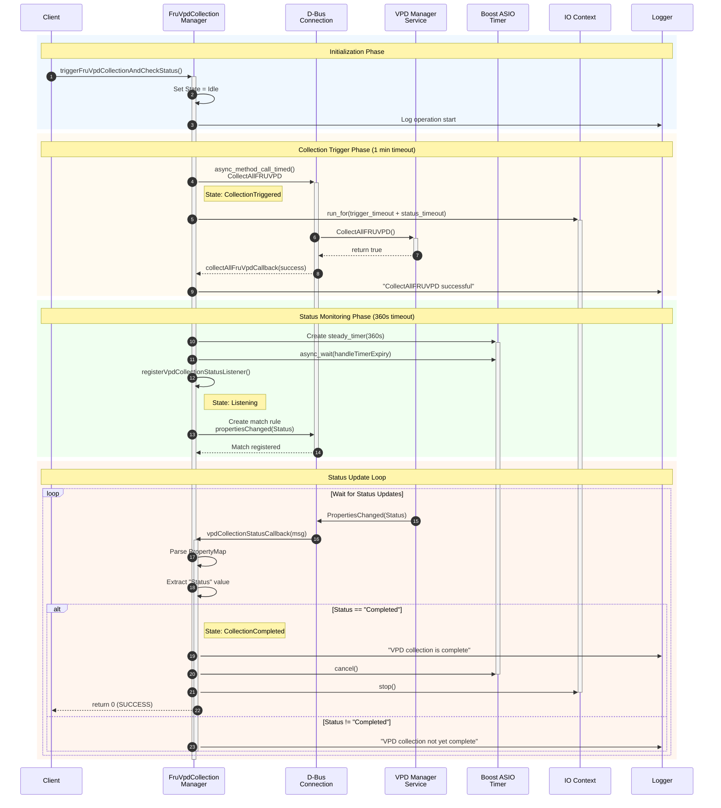

# FRU VPD Collection Manager - Sequence Diagram

This document contains sequence diagrams illustrating the flow of operations in the FRU VPD Collection Manager.

## Overview

The FRU VPD Collection Manager is responsible for:
1. Triggering FRU VPD collection via D-Bus
2. Monitoring collection status through property change signals
3. Managing timeouts for both collection trigger and status completion
4. Handling various error scenarios and state transitions

## Sequence Diagrams

### 1. Main Success Flow

This diagram shows the happy path when VPD collection completes successfully.



### 2. Error and Timeout Scenarios

This diagram illustrates the various error paths and timeout handling.

```mermaid
sequenceDiagram
    autonumber
    participant Client
    participant Manager as FruVpdCollection<br/>Manager
    participant DBus as D-Bus<br/>Connection
    participant VPD as VPD Manager<br/>Service
    participant Timer as Boost ASIO<br/>Timer
    participant IO as IO Context
    participant Log as Logger

    Client->>+Manager: triggerFruVpdCollectionAndCheckStatus()
    Manager->>Manager: Set State = Idle
    Manager->>Log: Log operation start
    Manager->>DBus: async_method_call_timed()<br/>CollectAllFRUVPD (1 min)
    Note right of Manager: State: CollectionTriggered
    Manager->>+IO: run_for(timeouts)

    alt Scenario 1: Collection Trigger Timeout
        rect rgb(255, 230, 230)
            Note over DBus,VPD: D-Bus call times out after 1 minute
            DBus-->>Manager: collectAllFruVpdCallback(TIMEOUT)
            Note right of Manager: State: CollectionTriggerTimeout
            Manager->>Log: "Timed out calling CollectAllFRUVPD"
            Manager->>IO: stop()
            deactivate IO
            Manager-->>-Client: throw runtime_error<br/>("Collection trigger timed out")
        end
    else Scenario 2: Collection Trigger Error
        rect rgb(255, 230, 230)
            Note over DBus,VPD: D-Bus call fails with error
            DBus-->>Manager: collectAllFruVpdCallback(ERROR)
            Note right of Manager: State: Failed
            Manager->>Log: Log error message
            Manager->>IO: stop()
            deactivate IO
            Manager-->>-Client: throw DbusException
        end
    else Scenario 3: Collection Status Timeout
        rect rgb(255, 240, 230)
            DBus->>+VPD: CollectAllFRUVPD()
            VPD-->>-DBus: return true
            DBus-->>Manager: collectAllFruVpdCallback(success)
            Manager->>Log: "CollectAllFRUVPD successful"
            Manager->>+Timer: Create steady_timer(360s)
            Manager->>Timer: async_wait(handleTimerExpiry)
            Manager->>Manager: registerVpdCollectionStatusListener()
            Note right of Manager: State: Listening
            Manager->>DBus: Create match rule
            
            Note over VPD,Timer: Status never becomes "Completed"<br/>Timer expires after 360 seconds
            
            Timer->>Manager: handleTimerExpiry(no error)
            Manager->>Log: "VPD collection not done after timeout"
            Manager->>Timer: cancel()
            deactivate Timer
            Manager->>IO: stop()
            deactivate IO
            Note right of Manager: State: Listening (timeout)
            Manager-->>-Client: throw runtime_error<br/>("Timed out listening for collection status")
        end
    else Scenario 4: VPD Service Returns False
        rect rgb(255, 230, 230)
            DBus->>+VPD: CollectAllFRUVPD()
            VPD-->>-DBus: return false
            DBus-->>Manager: collectAllFruVpdCallback(success, false)
            Note right of Manager: State: Failed
            Manager->>Log: "CollectAllFRUVPD failed"
            Manager->>IO: stop()
            deactivate IO
            Manager-->>-Client: throw DbusException<br/>("Failed to trigger FRU VPD collection")
        end
    end
```

### 3. Complete Flow with All Paths

This comprehensive diagram shows all possible execution paths.

```mermaid
sequenceDiagram
    participant Client
    participant Manager as FruVpdCollection<br/>Manager
    participant DBus as D-Bus<br/>Connection
    participant VPD as VPD Manager<br/>Service
    participant Timer as Boost ASIO<br/>Timer
    participant IO as IO Context
    participant Log as Logger

    Note over Manager: State: Idle

    Client->>+Manager: triggerFruVpdCollectionAndCheckStatus()
    
    Manager->>Log: Log operation start
    Manager->>Manager: Set State = Idle
    
    Manager->>DBus: async_method_call_timed()<br/>(CollectAllFRUVPD, 1 min timeout)
    Note over Manager: State: CollectionTriggered
    
    Manager->>+IO: run_for(trigger_timeout + status_timeout)
    
    alt Collection Trigger Success
        DBus->>+VPD: CollectAllFRUVPD()
        VPD-->>-DBus: return true
        
        DBus-->>Manager: collectAllFruVpdCallback(success, msg)
        
        Manager->>Log: Log "CollectAllFRUVPD successful"
        Manager->>Manager: Read response (collectionTriggered)
        
        Manager->>+Timer: Create steady_timer(collectionStatusTimeout)
        
        Manager->>Timer: async_wait(handleTimerExpiry)
        
        Manager->>Manager: registerVpdCollectionStatusListener()
        Note over Manager: State: Listening
        
        Manager->>DBus: Create match rule<br/>(propertiesChanged on Status)
        DBus-->>Manager: Match registered
        
        loop Wait for Status Updates
            VPD->>DBus: PropertiesChanged(Status)
            DBus->>Manager: vpdCollectionStatusCallback(msg)
            
            Manager->>Manager: Parse PropertyMap
            Manager->>Manager: Check Status value
            
            alt Status == "Completed"
                Note over Manager: State: CollectionCompleted
                Manager->>Log: Log "VPD collection is complete"
                Manager->>Timer: cancel()
                deactivate Timer
                Manager->>IO: stop()
                deactivate IO
            else Status != "Completed"
                Manager->>Log: Log "VPD collection not yet complete"
            end
        end
        Manager-->>-Client: return 0 (success)
        
    else Collection Trigger Timeout
        DBus-->>Manager: collectAllFruVpdCallback(timeout)
        Note over Manager: State: CollectionTriggerTimeout
        Manager->>Log: Log timeout error
        Manager->>IO: stop()
        deactivate IO
        Manager-->>-Client: throw runtime_error("Collection trigger timed out")
        
    else Collection Trigger Error
        DBus-->>Manager: collectAllFruVpdCallback(error)
        Note over Manager: State: Failed
        Manager->>Log: Log error
        Manager->>IO: stop()
        deactivate IO
        Manager-->>-Client: throw DbusException
        
    else VPD Service Returns False
        DBus->>+VPD: CollectAllFRUVPD()
        VPD-->>-DBus: return false
        DBus-->>Manager: collectAllFruVpdCallback(success, false)
        Note over Manager: State: Failed
        Manager->>Log: "CollectAllFRUVPD failed"
        Manager->>IO: stop()
        deactivate IO
        Manager-->>-Client: throw DbusException<br/>("Failed to trigger FRU VPD collection")
        
    else Status Timeout (Timer Expiry)
        DBus->>+VPD: CollectAllFRUVPD()
        VPD-->>-DBus: return true
        DBus-->>Manager: collectAllFruVpdCallback(success)
        Manager->>Log: "CollectAllFRUVPD successful"
        Manager->>+Timer: Create steady_timer(360s)
        Manager->>Timer: async_wait(handleTimerExpiry)
        Manager->>Manager: registerVpdCollectionStatusListener()
        Note over Manager: State: Listening
        Manager->>DBus: Create match rule
        
        Note over VPD,Timer: Status never becomes "Completed"<br/>Timer expires after 360 seconds
        
        Timer->>Manager: handleTimerExpiry(no error)
        Manager->>Log: Log "VPD collection not done after timeout"
        Manager->>Timer: cancel()
        deactivate Timer
        Manager->>IO: stop()
        deactivate IO
        Note over Manager: State: Listening (timeout)
        Manager-->>-Client: throw runtime_error("Timed out listening")
    end
```

## State Transitions

The manager transitions through the following states:

1. **Idle** → Initial state when `triggerFruVpdCollectionAndCheckStatus()` is called
2. **CollectionTriggered** → After D-Bus async call is initiated
3. **Listening** → After successful trigger, waiting for status property changes
4. **CollectionCompleted** → When Status property becomes "Completed"
5. **CollectionTriggerTimeout** → If D-Bus call times out (1 minute)
6. **Failed** → On any error during the process

## Key Components

### Timeouts
- **Collection Trigger Timeout**: 1 minute (60 seconds)
- **Collection Status Timeout**: 360 seconds (6 minutes) by default, configurable

### D-Bus Interface
- **Service**: Specified via `m_collectionServiceName`
- **Object Path**: Specified via `m_objectPath`
- **Interface**: Specified via `m_interface`
- **Method**: `CollectAllFRUVPD` (specified via `m_collectionMethodName`)
- **Property**: `Status` on `vpdCollectionInterface`

### Callbacks
1. **collectAllFruVpdCallback**: Handles the response from CollectAllFRUVPD D-Bus call
2. **vpdCollectionStatusCallback**: Processes property change signals for Status
3. **handleTimerExpiry**: Manages timeout scenarios

## Error Handling

The sequence diagram shows multiple error paths:
- Collection trigger timeout (1 minute)
- Collection trigger D-Bus errors
- Collection status timeout (6 minutes default)
- Internal errors during callback processing

All errors result in appropriate state transitions and exception throwing to the caller.