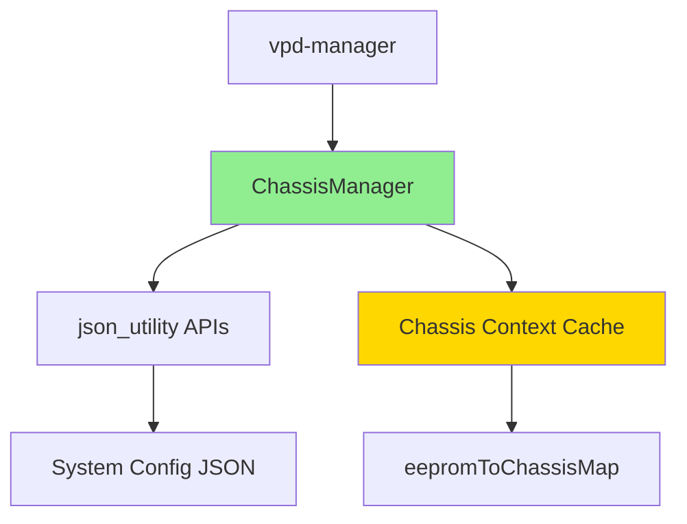

# Multi-Chassis System Configuration JSON Design Proposal

## Executive Summary

This document proposes an optimized design for supporting multi-chassis systems in the openpower-vpd-parser project. The current JSON structure is designed for single-chassis systems, and this proposal extends it to support multiple chassis while maintaining O(1) lookup performance for EEPROM-to-chassis mapping.

---

## Current System Analysis

### Current JSON Structure (Single Chassis)

The existing system configuration JSON (`60002000_v2.json`) has the following structure:

```json
{
  "devTree": "conf-aspeed-bmc-ibm-fuji.dtb",
  "backupRestoreConfigPath": "/usr/share/vpd/backup_restore_50003000.json",
  "commonInterfaces": { ... },
  "muxes": [ ... ],
  "frus": {
    "/sys/bus/i2c/drivers/at24/8-0050/eeprom": [ ... ],
    "/sys/bus/i2c/drivers/at24/8-0051/eeprom": [ ... ],
    ...
  }
}
```

### Key Limitations

1. **Single Chassis Assumption**: All FRUs are implicitly assumed to belong to one chassis
2. **No Chassis Identification**: No mechanism to identify which chassis an EEPROM belongs to
3. **Linear Search Required**: Current APIs like [`getFruPathFromJson()`](vpd-manager/include/utility/json_utility.hpp:669) iterate through all FRUs - O(n) complexity
4. **Scalability Issues**: Multi-chassis systems would require multiple JSON files or complex workarounds

### Current API Usage Pattern

Key APIs that need chassis context:
- [`getFruPathFromJson()`](vpd-manager/include/utility/json_utility.hpp:669) - Gets EEPROM path from inventory/redundant path
- [`getInventoryObjPathFromJson()`](vpd-manager/include/utility/json_utility.hpp:158) - Gets inventory path from EEPROM path
- [`getVPDOffset()`](vpd-manager/include/utility/json_utility.hpp:58) - Gets VPD offset for EEPROM path
- All APIs in [`json_utility.hpp`](vpd-manager/include/utility/json_utility.hpp:1) that accept `i_sysCfgJsonObj` parameter

---

## Proposed Multi-Chassis Design

### Design Goals

1. **O(1) Lookup**: Achieve constant-time lookup for chassis details given an EEPROM path
2. **Backward Compatibility**: Existing single-chassis JSONs should work without modification
3. **Minimal API Changes**: Existing [`json_utility`](vpd-manager/include/utility/json_utility.hpp:1) APIs should remain unchanged
4. **Scalability**: Support systems with multiple chassis efficiently
5. **Maintainability**: Clear separation of concerns with an abstraction layer

### Proposed JSON Schema

#### Option 1: Hierarchical Structure (Recommended)

```json
{
  "version": "2.0",
  "systemType": "multi-chassis",
  "chassis": {
    "chassis0": {
      "chassisId": "chassis0",
      "chassisPath": "/xyz/openbmc_project/inventory/system/chassis",
      "devTree": "conf-aspeed-bmc-ibm-fuji.dtb",
      "backupRestoreConfigPath": "/usr/share/vpd/backup_restore_chassis0.json",
      "commonInterfaces": { ... },
      "muxes": [ ... ],
      "frus": {
        "/sys/bus/i2c/drivers/at24/8-0050/eeprom": [ ... ],
        "/sys/bus/i2c/drivers/at24/8-0051/eeprom": [ ... ]
      }
    },
    "chassis1": {
      "chassisId": "chassis1",
      "chassisPath": "/xyz/openbmc_project/inventory/system/chassis1",
      "devTree": "conf-aspeed-bmc-ibm-fuji.dtb",
      "backupRestoreConfigPath": "/usr/share/vpd/backup_restore_chassis1.json",
      "commonInterfaces": { ... },
      "muxes": [ ... ],
      "frus": {
        "/sys/bus/i2c/drivers/at24/100-0050/eeprom": [ ... ],
        "/sys/bus/i2c/drivers/at24/101-0050/eeprom": [ ... ]
      }
    }
  },
  "eepromToChassisMap": {
    "/sys/bus/i2c/drivers/at24/8-0050/eeprom": "chassis0",
    "/sys/bus/i2c/drivers/at24/8-0051/eeprom": "chassis0",
    "/sys/bus/i2c/drivers/at24/100-0050/eeprom": "chassis1",
    "/sys/bus/i2c/drivers/at24/101-0050/eeprom": "chassis1"
  }
}
```

**Advantages:**
- Clear hierarchical organization
- O(1) lookup via `eepromToChassisMap`
- Each chassis maintains its own configuration
- Easy to add/remove chassis

#### Option 2: Flat Structure with Metadata

```json
{
  "version": "2.0",
  "systemType": "multi-chassis",
  "devTree": "conf-aspeed-bmc-ibm-fuji.dtb",
  "commonInterfaces": { ... },
  "chassisMetadata": [
    {
      "chassisId": "chassis0",
      "chassisPath": "/xyz/openbmc_project/inventory/system/chassis",
      "backupRestoreConfigPath": "/usr/share/vpd/backup_restore_chassis0.json"
    },
    {
      "chassisId": "chassis1",
      "chassisPath": "/xyz/openbmc_project/inventory/system/chassis1",
      "backupRestoreConfigPath": "/usr/share/vpd/backup_restore_chassis1.json"
    }
  ],
  "muxes": [ ... ],
  "frus": {
    "/sys/bus/i2c/drivers/at24/8-0050/eeprom": [
      {
        "chassisId": "chassis0",
        "inventoryPath": "/xyz/openbmc_project/inventory/system/chassis/motherboard",
        ...
      }
    ],
    "/sys/bus/i2c/drivers/at24/100-0050/eeprom": [
      {
        "chassisId": "chassis1",
        "inventoryPath": "/xyz/openbmc_project/inventory/system/chassis1/motherboard",
        ...
      }
    ]
  },
  "eepromToChassisMap": {
    "/sys/bus/i2c/drivers/at24/8-0050/eeprom": "chassis0",
    "/sys/bus/i2c/drivers/at24/100-0050/eeprom": "chassis1"
  }
}
```

**Advantages:**
- Less nesting
- Simpler migration from single-chassis
- Still provides O(1) lookup

**Recommendation**: Use **Option 1 (Hierarchical)** for better organization and isolation of chassis-specific configuration.

---

## Architecture Design

### Component Overview



### ChassisManager - New Abstraction Layer

Create a new class [`ChassisManager`](vpd-manager/include/utility/chassis_manager.hpp:1) that sits between vpd-manager and json_utility APIs.

#### Key Responsibilities

1. **Load and Parse Multi-Chassis JSON**: Detect JSON version and structure
2. **Build O(1) Lookup Cache**: Create in-memory hash map for EEPROM-to-chassis mapping
3. **Provide Chassis Context**: Return appropriate chassis-specific JSON for API calls
4. **Backward Compatibility**: Handle single-chassis JSONs transparently

#### Data Structures

```cpp
namespace vpd
{
namespace chassisUtility
{

// Chassis information structure
struct ChassisInfo
{
    std::string chassisId;
    std::string chassisPath;
    nlohmann::json chassisConfig;  // Chassis-specific config
};

// Main chassis manager class
class ChassisManager
{
public:
    /**
     * @brief Constructor - loads and parses system config JSON
     * @param[in] i_configJsonPath - Path to system config JSON
     * @throw JsonException on parsing errors
     */
    explicit ChassisManager(const std::string& i_configJsonPath);

    /**
     * @brief Get chassis ID for a given EEPROM path - O(1)
     * @param[in] i_eepromPath - EEPROM hardware path
     * @param[out] o_errCode - Error code if lookup fails
     * @return Chassis ID string, empty on failure
     */
    std::string getChassisIdForEeprom(const std::string& i_eepromPath,
                                      uint16_t& o_errCode) const noexcept;

    /**
     * @brief Get chassis-specific JSON config - O(1)
     * @param[in] i_chassisId - Chassis identifier
     * @param[out] o_errCode - Error code if lookup fails
     * @return Chassis-specific JSON object
     */
    nlohmann::json getChassisConfig(const std::string& i_chassisId,
                                    uint16_t& o_errCode) const noexcept;

    /**
     * @brief Get chassis-specific JSON for EEPROM path - O(1)
     * @param[in] i_eepromPath - EEPROM hardware path
     * @param[out] o_errCode - Error code if lookup fails
     * @return Chassis-specific JSON object
     */
    nlohmann::json getChassisConfigForEeprom(const std::string& i_eepromPath,
                                             uint16_t& o_errCode) const noexcept;

    /**
     * @brief Get all chassis IDs in the system
     * @return Vector of chassis ID strings
     */
    std::vector<std::string> getAllChassisIds() const noexcept;

    /**
     * @brief Check if system is multi-chassis
     * @return true if multi-chassis, false for single-chassis
     */
    bool isMultiChassis() const noexcept;

    /**
     * @brief Get full system config JSON (for backward compatibility)
     * @return Complete system config JSON
     */
    const nlohmann::json& getSystemConfig() const noexcept;

private:
    // Parse and build internal data structures
    void parseAndBuildCache();
    
    // Build EEPROM to chassis mapping - O(n) at initialization
    void buildEepromToChassisMap();

    // System config JSON
    nlohmann::json m_systemConfigJson;
    
    // EEPROM path to chassis ID map - O(1) lookup
    std::unordered_map<std::string, std::string> m_eepromToChassisMap;
    
    // Chassis ID to chassis info map - O(1) lookup
    std::unordered_map<std::string, ChassisInfo> m_chassisInfoMap;
    
    // Flag indicating multi-chassis system
    bool m_isMultiChassis{false};
    
    // JSON version
    std::string m_jsonVersion{"1.0"};
};

} // namespace chassisUtility
} // namespace vpd
```

---

## API Integration Strategy

### Wrapper APIs in json_utility

Add new wrapper functions that use ChassisManager internally:

```cpp
namespace vpd
{
namespace jsonUtility
{

/**
 * @brief Get FRU path with chassis context - O(1)
 * @param[in] i_chassisManager - Chassis manager instance
 * @param[in] i_vpdPath - VPD path (EEPROM/inventory/redundant)
 * @param[out] o_errCode - Error code
 * @return FRU EEPROM path
 */
inline std::string getFruPathFromJsonWithChassis(
    const chassisUtility::ChassisManager& i_chassisManager,
    const std::string& i_vpdPath,
    uint16_t& o_errCode)
{
    // Get chassis-specific JSON - O(1)
    auto l_chassisJson = i_chassisManager.getChassisConfigForEeprom(
        i_vpdPath, o_errCode);
    
    if (o_errCode)
    {
        return std::string{};
    }
    
    // Use existing API with chassis-specific JSON
    return getFruPathFromJson(l_chassisJson, i_vpdPath, o_errCode);
}

/**
 * @brief Get inventory path with chassis context - O(1)
 * @param[in] i_chassisManager - Chassis manager instance
 * @param[in] i_vpdPath - VPD path
 * @param[out] o_errCode - Error code
 * @return Inventory object path
 */
inline std::string getInventoryObjPathFromJsonWithChassis(
    const chassisUtility::ChassisManager& i_chassisManager,
    const std::string& i_vpdPath,
    uint16_t& o_errCode) noexcept
{
    auto l_chassisJson = i_chassisManager.getChassisConfigForEeprom(
        i_vpdPath, o_errCode);
    
    if (o_errCode)
    {
        return std::string{};
    }
    
    return getInventoryObjPathFromJson(l_chassisJson, i_vpdPath, o_errCode);
}

// Similar wrappers for other APIs...

} // namespace jsonUtility
} // namespace vpd
```

### Integration with Worker Class

Modify [`Worker`](vpd-manager/include/worker.hpp:28) class to use ChassisManager:

```cpp
class Worker
{
public:
    Worker(std::string pathToConfigJson = std::string(),
           uint8_t i_maxThreadCount = constants::MAX_THREADS,
           types::VpdCollectionMode i_vpdCollectionMode =
               types::VpdCollectionMode::DEFAULT_MODE);

    // ... existing methods ...

    /**
     * @brief Get chassis manager instance
     * @return Shared pointer to chassis manager
     */
    inline const std::shared_ptr<chassisUtility::ChassisManager>& 
    getChassisManager() const
    {
        return m_chassisManager;
    }

private:
    // Parsed JSON file (kept for backward compatibility)
    nlohmann::json m_parsedJson{};
    
    // NEW: Chassis manager for multi-chassis support
    std::shared_ptr<chassisUtility::ChassisManager> m_chassisManager;
    
    // ... existing members ...
};
```

---

## Backward Compatibility Strategy

### Single-Chassis JSON Support

The ChassisManager will automatically detect single-chassis JSONs (version 1.0 or missing version field) and create a virtual "chassis0" internally:

```cpp
void ChassisManager::parseAndBuildCache()
{
    // Check JSON version
    m_jsonVersion = m_systemConfigJson.value("version", "1.0");
    
    if (m_jsonVersion == "1.0" || !m_systemConfigJson.contains("chassis"))
    {
        // Single-chassis JSON - create virtual chassis0
        m_isMultiChassis = false;
        
        ChassisInfo l_chassis0;
        l_chassis0.chassisId = "chassis0";
        l_chassis0.chassisPath = "/xyz/openbmc_project/inventory/system/chassis";
        l_chassis0.chassisConfig = m_systemConfigJson;
        
        m_chassisInfoMap["chassis0"] = l_chassis0;
        
        // Build EEPROM map from single chassis
        buildEepromToChassisMapForSingleChassis();
    }
    else
    {
        // Multi-chassis JSON
        m_isMultiChassis = true;
        buildEepromToChassisMapFromJson();
    }
}
```

### API Compatibility

1. **Existing APIs remain unchanged**: All current [`json_utility`](vpd-manager/include/utility/json_utility.hpp:1) APIs continue to work
2. **New chassis-aware APIs added**: Optional chassis-aware wrappers for better performance
3. **Gradual migration**: Code can be migrated incrementally to use ChassisManager

---

## Performance Analysis

### Current System (Single Chassis)

- **EEPROM lookup**: O(n) - iterates through all FRUs
- **Memory**: Single JSON in memory
- **Scalability**: Poor for large systems

### Proposed System (Multi-Chassis)

- **EEPROM lookup**: O(1) - hash map lookup
- **Chassis config retrieval**: O(1) - hash map lookup
- **Memory overhead**: Minimal - one hash map entry per EEPROM
- **Initialization**: O(n) - one-time cost to build maps
- **Scalability**: Excellent - constant time regardless of chassis count

### Performance Comparison

| Operation | Current | Proposed | Improvement |
|-----------|---------|----------|-------------|
| Get chassis for EEPROM | N/A | O(1) | New capability |
| Get FRU path | O(n) | O(1) | n-fold improvement |
| Get inventory path | O(n) | O(1) | n-fold improvement |
| Get VPD offset | O(n) | O(1) | n-fold improvement |
| Memory usage | 1x | ~1.1x | Minimal overhead |

---

## Migration Guide

### For Single-Chassis Systems

**No changes required** - existing JSONs work as-is.

### For Multi-Chassis Systems

#### Step 1: Update JSON Structure

Convert from:
```json
{
  "devTree": "...",
  "frus": { ... }
}
```

To:
```json
{
  "version": "2.0",
  "systemType": "multi-chassis",
  "chassis": {
    "chassis0": {
      "chassisId": "chassis0",
      "devTree": "...",
      "frus": { ... }
    },
    "chassis1": {
      "chassisId": "chassis1",
      "devTree": "...",
      "frus": { ... }
    }
  },
  "eepromToChassisMap": {
    "/sys/bus/i2c/drivers/at24/8-0050/eeprom": "chassis0",
    "/sys/bus/i2c/drivers/at24/100-0050/eeprom": "chassis1"
  }
}
```

#### Step 2: Update Code (Optional)

For better performance, update code to use chassis-aware APIs:

```cpp
// Old way (still works)
auto l_fruPath = jsonUtility::getFruPathFromJson(
    m_worker->getSysCfgJsonObj(), i_vpdPath, l_errCode);

// New way (O(1) performance)
auto l_fruPath = jsonUtility::getFruPathFromJsonWithChassis(
    *m_worker->getChassisManager(), i_vpdPath, l_errCode);
```

---

## Implementation Phases

### Phase 1: Core Infrastructure
- Create [`ChassisManager`](vpd-manager/include/utility/chassis_manager.hpp:1) class
- Implement JSON parsing for both single and multi-chassis
- Build EEPROM-to-chassis mapping with O(1) lookup
- Add unit tests

### Phase 2: API Integration
- Add chassis-aware wrapper APIs in [`json_utility`](vpd-manager/include/utility/json_utility.hpp:1)
- Integrate ChassisManager with [`Worker`](vpd-manager/include/worker.hpp:28) class
- Update [`Manager`](vpd-manager/include/manager.hpp:22) class to use ChassisManager
- Maintain backward compatibility

### Phase 3: Testing & Validation
- Test with existing single-chassis JSONs
- Create multi-chassis test JSONs
- Performance benchmarking
- Validate O(1) lookup performance

### Phase 4: Documentation & Migration
- Update documentation
- Create migration guide
- Provide example multi-chassis JSONs
- Update build system if needed

---

## Testing Strategy

### Unit Tests

1. **ChassisManager Tests**
   - Single-chassis JSON parsing
   - Multi-chassis JSON parsing
   - O(1) lookup validation
   - Error handling

2. **API Wrapper Tests**
   - Chassis-aware API functionality
   - Backward compatibility
   - Error propagation

### Integration Tests

1. **Single-Chassis Compatibility**
   - Existing JSONs work unchanged
   - All existing APIs function correctly

2. **Multi-Chassis Functionality**
   - Multiple chassis detection
   - Correct chassis-to-EEPROM mapping
   - Cross-chassis operations

### Performance Tests

1. **Lookup Performance**
   - Measure O(1) lookup time
   - Compare with current O(n) approach
   - Validate constant time across chassis counts

2. **Memory Usage**
   - Measure memory overhead
   - Validate acceptable memory footprint

---

## Risk Analysis

### Risks & Mitigations

| Risk | Impact | Mitigation |
|------|--------|------------|
| Breaking existing code | High | Maintain full backward compatibility |
| Performance regression | Medium | Thorough benchmarking before release |
| Complex migration | Medium | Provide clear documentation and tools |
| Memory overhead | Low | Optimize data structures, monitor usage |
| JSON parsing errors | Medium | Robust error handling and validation |

---

## Conclusion

This design provides:

1. ✅ **O(1) lookup** for chassis details from EEPROM path
2. ✅ **Full backward compatibility** with existing single-chassis JSONs
3. ✅ **Minimal API changes** - existing APIs remain functional
4. ✅ **Clear abstraction** through ChassisManager layer
5. ✅ **Scalability** for multi-chassis systems
6. ✅ **Maintainability** with clean separation of concerns

The proposed ChassisManager abstraction layer achieves all design goals while maintaining the integrity of existing [`json_utility`](vpd-manager/include/utility/json_utility.hpp:1) APIs.

---

## Next Steps

1. Review and approve this design proposal
2. Create detailed implementation tickets
3. Begin Phase 1 implementation
4. Conduct code reviews at each phase
5. Perform comprehensive testing
6. Update documentation
7. Release with migration guide